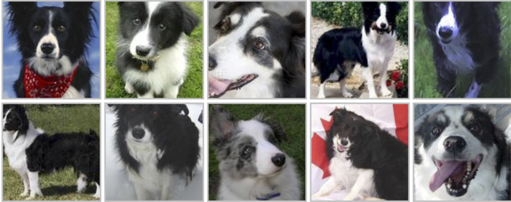

# Dog breed classification

Module used for the purpose of the kaggle playground competition Dog Breed Identification. 
For more info please see https://www.kaggle.com/competitions/dog-breed-identification/overview
More models were built during the development process (they can be found in the models/development/ folder).
Only the main model can be used for training from the terminal. 


<div align="center"><a href="https://github.com/petrakopic/dog_breed_classification">

</a>
</div>


## Requirements

- python >= 3.7.x


## Instalation

### Steps
1. Download the kaggle dataset.
Use the instruction from here https://github.com/Kaggle/kaggle-api to install the Kaggle API
```bash
kaggle competitions download -c dog-breed-identification
```


2. Run project installation
```bash
python3 -m pip install -e 
```

3. Visualize some images from the dataset: 
```bash
python -m cli.commands show_multiple --image_path "data/train" --num_img 4
```

4. To start the training process: 
```bash
python -m cli.commands train_model --image_path "data/train"
```
See vailable options with: 
```bash
python -m cli.commands train_model --help
```